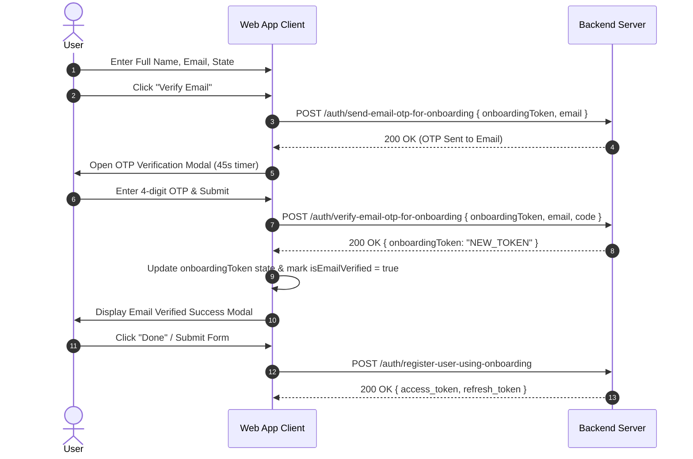
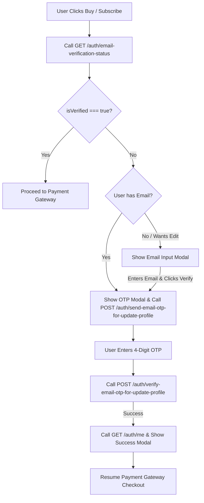

# Email Verification, State Data & Payment Pre-Check Documentation

This document outlines the complete Email Verification architecture, API endpoints, request/response payloads, Indian States data, and step-by-step UI/UX flows extracted from the mobile application. This specification is designed for seamless implementation into the **MIA Web Application**.

---

## 📍 Base Configuration

- **Base URL**: `https://miaapi.mahiradvisors.com`
- **Default Headers**:
  - `Accept: application/json`
  - `Content-Type: application/json`
- **Authenticated Headers**:
  - `Authorization: Bearer <access_token>`
- **OTP Rules**:
  - Code Length: **4 digits** (numeric)
  - Resend Timer: **45 seconds** countdown
  - Verification Behavior: Modal automatically triggers API call upon open (`autoSendOnOpen = true`)

---

## 🗂 API Endpoints Overview

| Endpoint Path | Method | Auth Required | Purpose |
| :--- | :--- | :--- | :--- |
| `/auth/send-email-otp-for-onboarding` | `POST` | ❌ No | Send OTP during initial user registration |
| `/auth/verify-email-otp-for-onboarding` | `POST` | ❌ No | Verify OTP & receive updated `onboardingToken` |
| `/auth/register-user-using-onboarding` | `POST` | ❌ No | Complete user registration with `onboardingToken` |
| `/auth/send-email-otp-for-update-profile` | `POST` | `Bearer Token` | Send OTP for profile email update / verification |
| `/auth/verify-email-otp-for-update-profile` | `POST` | `Bearer Token` | Verify OTP for profile email update |
| `/auth/email-verification-status` | `GET` | `Bearer Token` | Check if logged-in user's email is verified |
| `/auth/me` | `GET` | `Bearer Token` | Fetch updated user profile after verification |

---

## 🔄 1. Onboarding Email Verification Flow (Pre-Authentication)

Used when a new user signs up or completes their profile details before creating an account.



### API 1.1: Send OTP for Onboarding
- **Endpoint**: `POST /auth/send-email-otp-for-onboarding`
- **Request Body**:
  ```json
  {
    "onboardingToken": "eyJhbGciOiJIUzI1NiIsInR5cCI6...",
    "email": "user@example.com"
  }
  ```
- **Response**:
  ```json
  {
    "success": true,
    "message": "OTP sent successfully to email"
  }
  ```

### API 1.2: Verify OTP for Onboarding
- **Endpoint**: `POST /auth/verify-email-otp-for-onboarding`
- **Request Body**:
  ```json
  {
    "onboardingToken": "eyJhbGciOiJIUzI1NiIsInR5cCI6...",
    "email": "user@example.com",
    "code": "1234"
  }
  ```
- **Response**:
  ```json
  {
    "success": true,
    "message": "Email verified successfully",
    "data": {
      "onboardingToken": "eyJhbGciOiJIUzI1NiIsInR5cCI6_UPDATED_TOKEN..."
    }
  }
  ```
> **IMPORTANT**: Replace the existing `onboardingToken` in your application state with the new `onboardingToken` returned in this response.

---

## 👤 2. Profile Email Update & Verification Flow (Authenticated)

Used when a logged-in user changes their email address or verifies an unverified email in Profile Settings.

### API 2.1: Send Profile Email OTP
- **Endpoint**: `POST /auth/send-email-otp-for-update-profile`
- **Headers**: `Authorization: Bearer <access_token>`
- **Request Body**:
  ```json
  {
    "email": "newemail@example.com"
  }
  ```
- **Response**:
  ```json
  {
    "success": true,
    "message": "OTP sent to your email address",
    "data": {}
  }
  ```

### API 2.2: Verify Profile Email OTP
- **Endpoint**: `POST /auth/verify-email-otp-for-update-profile`
- **Headers**: `Authorization: Bearer <access_token>`
- **Request Body**:
  ```json
  {
    "email": "newemail@example.com",
    "code": "1234"
  }
  ```
- **Response**:
  ```json
  {
    "success": true,
    "message": "Email address updated and verified successfully"
  }
  ```

### API 2.3: Refresh User Profile (`GET /auth/me`)
- **Endpoint**: `GET /auth/me`
- **Headers**: `Authorization: Bearer <access_token>`
- **Response**:
  ```json
  {
    "success": true,
    "data": {
      "id": "usr_12345",
      "firstName": "John",
      "lastName": "Doe",
      "email": "newemail@example.com",
      "isEmailVerified": true,
      "emailVerifiedAt": "2026-08-17T12:00:00.000Z"
    }
  }
  ```

---

## 💳 3. Payment Pre-Check Email Verification Flow

Before completing any subscription checkout (e.g. purchasing a plan via Razorpay / Stripe), the application **MUST** check if the user's email is verified. If verified, proceed directly to payment. If not verified, trigger the verification modal flow first.



### API 3.1: Get Email Verification Status
- **Endpoint**: `GET /auth/email-verification-status`
- **Headers**: `Authorization: Bearer <access_token>`
- **Response**:
  ```json
  {
    "success": true,
    "isVerified": false,
    "email": "user@example.com"
  }
  ```
  *(Note: Check `res.isVerified` or `res.data.isVerified` or `res.isEmailVerified`)*

### Step-by-Step Payment Interception Logic (Web App):

1. **User clicks "Pay Now" / "Subscribe"**:
   Call `getEmailVerificationStatusApi()`.
   ```ts
   const checkEmailBeforePayment = async (): Promise<boolean> => {
     try {
       const res = await api.get('/auth/email-verification-status');
       const isVerified = Boolean(
         res?.isVerified ?? res?.data?.isVerified ?? res?.isEmailVerified ?? false
       );

       if (isVerified) {
         return true; // Email verified, proceed with payment
       }

       // Set current email & trigger verification modal
       const currentEmail = res?.email || res?.data?.email || userProfile?.email || '';
       if (!currentEmail) {
         openEmailInputModal();
       } else {
         openOtpVerificationModal(currentEmail);
       }
       return false; // Intercept payment
     } catch (error) {
       console.error('Email status check failed', error);
       return false;
     }
   };
   ```

2. **If `isVerified === false`**:
   - If no email exists, display **Email Input Dialog** (`EmailInputModal`).
   - When email is entered/confirmed, trigger **OTP Modal** (`EmailOtpVerificationModal`).
   - Call `POST /auth/send-email-otp-for-update-profile` with `{ email }`.
   - User inputs 4-digit code and submits.
   - Call `POST /auth/verify-email-otp-for-update-profile` with `{ email, code }`.
   - On success:
     - Re-fetch profile (`GET /auth/me`).
     - Display **Email Verified Success Dialog** (`EmailVerifiedSuccessModal`).
     - Automatically open payment modal (Razorpay / Stripe) or resume payment flow!

---

## 🎨 4. Web UI Components & Modal States

For the Web App (Next.js / React), replicate the 3 modular modal/dialog views used in the mobile app:

### Component 1: `EmailInputModal`
- **Purpose**: Let user enter or edit their email address before sending OTP.
- **Fields**: Single input `email` (`type="email"`).
- **CTA**: "Verify" button.

### Component 2: `EmailOtpVerificationModal`
- **Purpose**: Input 4-digit OTP, resend timer, confirm verification.
- **Header**: Icon, Title ("Verify Your Mail"), Subtitle ("We've sent a 4-digit verification code to...").
- **Email Row**: Shows email address with an Edit (Pen) icon to switch back to Email Input.
- **OTP Inputs**: 4 separate box inputs with auto-focus next on digit entry and backspace handling.
- **Resend Counter**: 45s countdown (`Resend OTP in 45s`), active button when timer hits 0.
- **CTA**: "Verify" button.

### Component 3: `EmailVerifiedSuccessModal`
- **Purpose**: Confirmation of successful verification.
- **Header**: Green Checkmark Icon, Title ("Email Verified Successfully").
- **Info Card**: Green pill container showing `email` address with a verified badge.
- **CTA**: "Done" / "Proceed to Payment" button.

---

## 💻 5. Ready-to-Use Web Code Pattern (React / Next.js)

```tsx
import React, { useState } from 'react';
import { api } from '@/lib/api';

export function CheckoutButton({ planId }: { planId: string }) {
  const [email, setEmail] = useState('');
  const [showInputModal, setShowInputModal] = useState(false);
  const [showOtpModal, setShowOtpModal] = useState(false);
  const [showSuccessModal, setShowSuccessModal] = useState(false);

  const initiateCheckout = async () => {
    // 1. Pre-check Email Status
    const res = await api.get('/auth/email-verification-status');
    const isVerified = Boolean(res?.isVerified ?? res?.data?.isVerified ?? false);

    if (isVerified) {
      startPaymentGateway(planId);
      return;
    }

    // 2. Intercept & prompt email verification
    setEmail(res?.email || res?.data?.email || '');
    setShowInputModal(true);
  };

  const handleSendOtp = async (targetEmail: string) => {
    await api.post('/auth/send-email-otp-for-update-profile', { email: targetEmail });
    setShowInputModal(false);
    setShowOtpModal(true);
  };

  const handleVerifyOtp = async (code: string) => {
    await api.post('/auth/verify-email-otp-for-update-profile', { email, code });
    setShowOtpModal(false);
    setShowSuccessModal(true);
  };

  const handleSuccessDone = () => {
    setShowSuccessModal(false);
    // Proceed to payment now that email is verified
    startPaymentGateway(planId);
  };

  return (
    <>
      <button onClick={initiateCheckout} className="btn-primary">
        Proceed to Pay
      </button>

      {/* Render EmailInputModal, EmailOtpVerificationModal, EmailVerifiedSuccessModal here */}
    </>
  );
}
```

---

## 🏛 6. Indian States & Union Territories Data (State Data)

Used for user onboarding (`UserDetailsForm`), profile edit (`ProfileScreen`), and tax/billing address fields.

### TypeScript Enum & Constant Array
```typescript
export enum IndianState {
  // 28 States
  ANDHRA_PRADESH = 'Andhra Pradesh',
  ARUNACHAL_PRADESH = 'Arunachal Pradesh',
  ASSAM = 'Assam',
  BIHAR = 'Bihar',
  CHHATTISGARH = 'Chhattisgarh',
  GOA = 'Goa',
  GUJARAT = 'Gujarat',
  HARYANA = 'Haryana',
  HIMACHAL_PRADESH = 'Himachal Pradesh',
  JHARKHAND = 'Jharkhand',
  KARNATAKA = 'Karnataka',
  KERALA = 'Kerala',
  MADHYA_PRADESH = 'Madhya Pradesh',
  MAHARASHTRA = 'Maharashtra',
  MANIPUR = 'Manipur',
  MEGHALAYA = 'Meghalaya',
  MIZORAM = 'Mizoram',
  NAGALAND = 'Nagaland',
  ODISHA = 'Odisha',
  PUNJAB = 'Punjab',
  RAJASTHAN = 'Rajasthan',
  SIKKIM = 'Sikkim',
  TAMIL_NADU = 'Tamil Nadu',
  TELANGANA = 'Telangana',
  TRIPURA = 'Tripura',
  UTTAR_PRADESH = 'Uttar Pradesh',
  UTTARAKHAND = 'Uttarakhand',
  WEST_BENGAL = 'West Bengal',

  // 8 Union Territories
  ANDAMAN_AND_NICOBAR_ISLANDS = 'Andaman and Nicobar Islands',
  CHANDIGARH = 'Chandigarh',
  DADRA_AND_NAGAR_HAVELI_AND_DAMAN_AND_DIU = 'Dadra and Nagar Haveli and Daman and Diu',
  DELHI = 'Delhi',
  JAMMU_AND_KASHMIR = 'Jammu and Kashmir',
  LADAKH = 'Ladakh',
  LAKSHADWEEP = 'Lakshadweep',
  PUDUCHERRY = 'Puducherry',
}

export const INDIAN_STATES: string[] = Object.values(IndianState);
```

### JSON Array Format
```json
[
  "Andhra Pradesh",
  "Arunachal Pradesh",
  "Assam",
  "Bihar",
  "Chhattisgarh",
  "Goa",
  "Gujarat",
  "Haryana",
  "Himachal Pradesh",
  "Jharkhand",
  "Karnataka",
  "Kerala",
  "Madhya Pradesh",
  "Maharashtra",
  "Manipur",
  "Meghalaya",
  "Mizoram",
  "Nagaland",
  "Odisha",
  "Punjab",
  "Rajasthan",
  "Sikkim",
  "Tamil Nadu",
  "Telangana",
  "Tripura",
  "Uttar Pradesh",
  "Uttarakhand",
  "West Bengal",
  "Andaman and Nicobar Islands",
  "Chandigarh",
  "Dadra and Nagar Haveli and Daman and Diu",
  "Delhi",
  "Jammu and Kashmir",
  "Ladakh",
  "Lakshadweep",
  "Puducherry"
]
```
