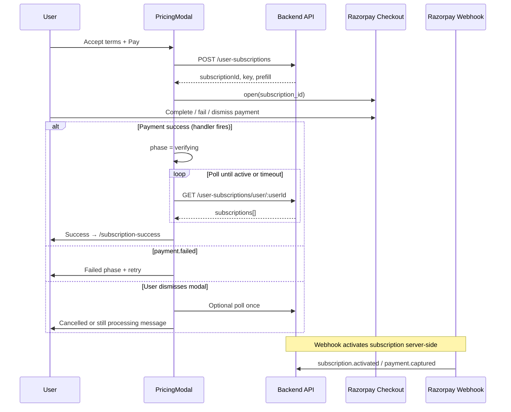

# MAHIR Razorpay Subscription — Recommended Flow

> **Scope:** Subscription checkout in `components/pages/home/pricing-section.tsx`  
> **Last updated:** August 2026  
> **Status:** Design doc — implement after backend confirms activation model

---

## 1. Executive summary

MAHIR uses **Razorpay Subscriptions** (`subscription_id`), not one-time **Orders** (`order_id`). The IISME EnrollModal pattern (order + signature verify) is a different product and should **not** be copied verbatim.

The best flow for MAHIR:

1. User confirms terms in the pricing modal.
2. Backend creates a Razorpay subscription → returns `subscriptionId`, `key`, metadata.
3. Frontend opens Razorpay Checkout with `subscription_id`.
4. On Razorpay success, **do not trust the client handler alone** — poll backend until subscription is `active`.
5. Only then show success UI and redirect to `/subscription-success`.

This matches how Razorpay subscriptions actually activate (webhooks + server state), while borrowing the **UX patterns** from the working order app (phases, dismiss race handling, failure states).

---

## 2. Payment model comparison

| Aspect | Order checkout (IISME reference) | Subscription checkout (MAHIR) |
|--------|----------------------------------|-------------------------------|
| Razorpay API | Orders API | Subscriptions API |
| Checkout field | `order_id` + `amount` + `currency` | `subscription_id` |
| Post-pay verify | `POST verify` with `razorpay_signature` | Poll `GET /user-subscriptions/user/:userId` |
| Recurring | No | Yes (auto-renewals via Razorpay) |
| Frontend lib | `openRazorpayCheckout({ order_id, ... })` | `openRazorpayCheckout({ subscription_id, ... })` |

**Rule:** Keep subscription checkout. Improve verification and UX — do not switch to orders unless the backend team changes the payment product.

---

## 3. Current implementation gaps

File: `components/pages/home/pricing-section.tsx` (`handleBuyPlan`)

| # | Issue | Risk |
|---|--------|------|
| 1 | Success handler redirects immediately without backend check | User sees “success” before subscription is active |
| 2 | `setPurchasing(false)` in `finally` runs when modal opens | Double-click / duplicate checkout |
| 3 | Script load failure still redirects to `/subscription-success` | False success |
| 4 | No `payment.failed` handler | Silent failures |
| 5 | `modal.ondismiss` always shows “Checkout Closed” | Wrong message after success/failure (race) |
| 6 | Inline script loader, no shared typed utility | Hard to maintain, no reuse |
| 7 | No “paying” / “verifying” UI phase | Poor UX while Razorpay is open |
| 8 | No tab-return verification | User closes Razorpay tab and status is unknown |
| 9 | No user prefill (email/phone) | Extra friction in Razorpay form |

Legacy reference (`mahir-mia-fe/.../SubscriptionPaymentModel.tsx`) partially solved #8 with `visibilitychange` + `verifyUserSubscription`, but never wired verify into the success handler.

---

## 4. Target architecture

### 4.1 High-level sequence



### 4.2 UI state machine

Use explicit phases (same idea as EnrollModal, adapted for subscriptions):

```
checkout → creating → paying → verifying → success
                              ↘ failed
                              ↘ cancelled (optional distinct from failed)
```

| Phase | When | UI |
|-------|------|-----|
| `checkout` | Modal open, terms visible | Plan summary, checkboxes, Pay button |
| `creating` | `createUserSubscription` in flight | Button spinner: “Preparing checkout…” |
| `paying` | Razorpay modal open | Overlay: “Complete payment in Razorpay window” |
| `verifying` | Handler fired OR tab became visible | Spinner: “Confirming your subscription…” |
| `success` | Backend confirms `active` | Brief in-modal success OR redirect |
| `failed` | API error, `payment.failed`, verify timeout | Error message + Try again |

Reset all phase state when modal closes.

---

## 5. Shared Razorpay utility

Create `lib/razorpay-checkout.ts` (browser-only, public key).

### 5.1 Responsibilities

- Load `https://checkout.razorpay.com/v1/checkout.js` once (dedupe in-flight promise).
- Typed options for **both** order and subscription (MAHIR uses subscription).
- `openRazorpayCheckout()` with:
  - `onSuccess` — Razorpay handler callback
  - `onPaymentFailed` — `rzp.on('payment.failed', ...)`
  - `onDismiss` — `modal.ondismiss`

### 5.2 Subscription options shape

```ts
type RazorpaySubscriptionCheckoutOptions = {
  key: string;
  subscription_id: string;
  name: string;
  description?: string;
  prefill?: { name?: string; email?: string; contact?: string };
  notes?: Record<string, string>;
  theme?: { color?: string };
};
```

Do **not** pass `amount` / `currency` / `order_id` for subscription checkout unless backend explicitly requires them.

### 5.3 What to remove from pricing-section

- Delete local `loadRazorpayScript()`.
- Import `openRazorpayCheckout` from `@/lib/razorpay-checkout`.

---

## 6. Recommended `handleBuyPlan` flow

### Step 1 — Preconditions

- User authenticated (`user.id` or `user._id`).
- Terms + market risk checkboxes accepted.
- `selectedPlan` set.

### Step 2 — Create subscription

```ts
setPhase('creating');
const res = await createUserSubscription({
  userId: String(actualUserId),
  variantId: String(selectedPlan.variantId || selectedPlan.id),
  acceptedMarketRiskTerms: true,
});
```

Expected success payload (confirm field names with backend):

```ts
{
  success: true,
  data: {
    key: string;              // Razorpay key_id (public)
    subscriptionId: string;   // sub_xxx
    name?: string;
    description?: string;
    prefill?: { name?, email?, contact? };
  }
}
```

On failure → `phase = 'failed'`, show API message. **Never redirect to success.**

### Step 3 — Open Razorpay

```ts
setPhase('paying');
outcomeRef.current = 'none';

await openRazorpayCheckout({
  key: res.data.key,
  subscription_id: res.data.subscriptionId,
  name: res.data.name ?? 'MAHIR Invest',
  description: res.data.description ?? selectedPlan.title,
  prefill: res.data.prefill ?? buildPrefillFromAuthUser(user),
  theme: { color: '#203468' },
  onSuccess: () => verifyAndComplete(),
  onPaymentFailed: (r) => showFailed(r.error?.description ?? 'Payment failed'),
  onDismiss: handleDismissWithGuard,
});
```

**Important:** Do **not** call `setPurchasing(false)` in a `finally` block here. Keep loading until phase leaves `paying` / `verifying`.

### Step 4 — Verify subscription (critical)

```ts
async function verifyAndComplete() {
  setPhase('verifying');
  outcomeRef.current = 'pending';

  const active = await pollSubscriptionActive(userId, {
    maxAttempts: 12,      // e.g. 12 × 2s = 24s
    intervalMs: 2000,
  });

  if (active) {
    outcomeRef.current = 'success';
    setPhase('success');
    // Optional: refresh auth/subscription store
    router.push('/subscription-success');
  } else {
    outcomeRef.current = 'failed';
    showFailed(
      'Payment received but activation is still processing. Please wait a minute and check your profile, or contact support.',
    );
  }
}
```

```ts
function isSubscriptionActive(sub: unknown): boolean {
  const s = sub as { status?: string; razorpayStatus?: string };
  return s.status === 'active' || s.razorpayStatus === 'active';
}

async function pollSubscriptionActive(userId: string, opts) {
  for (let i = 0; i < opts.maxAttempts; i++) {
    const res = await verifyUserSubscription(userId);
    const list = res?.data?.data ?? res?.data ?? [];
    if (Array.isArray(list) && list.some(isSubscriptionActive)) return true;
    await sleep(opts.intervalMs);
  }
  return false;
}
```

### Step 5 — Dismiss guard (from EnrollModal)

Razorpay often fires `ondismiss` after `handler` or `payment.failed`. Use a ref:

```ts
type Outcome = 'none' | 'pending' | 'success' | 'failed';

function handleDismissWithGuard() {
  window.setTimeout(() => {
    if (outcomeRef.current !== 'none') return;
    // Optional: one verification attempt before calling it cancelled
    verifyAndComplete().catch(() =>
      showFailed('Payment was cancelled. You can try again anytime.'),
    );
  }, 150);
}
```

---

## 7. Tab visibility fallback

Port from legacy `SubscriptionPaymentModel`:

- When `phase === 'paying'` or `paymentInitiated === true`, listen to `document.visibilitychange`.
- On `visible`, run `verifyAndComplete()` once (debounced).
- Covers: user completes payment in Razorpay popup/tab and returns to MAHIR tab.

---

## 8. Backend coordination checklist

Confirm with API team **before** shipping:

| Question | Why it matters |
|----------|----------------|
| Does `POST /user-subscriptions` always return `subscriptionId` + `key`? | Required for checkout |
| Which field is authoritative: `status` or `razorpayStatus`? | Poll logic |
| Is activation **webhook-only** or synchronous after first payment? | Poll timeout / copy |
| Should we match by `variantId` when polling, not just any active sub? | Avoid false positive from old subscription |
| Is there (or will there be) `POST /user-subscriptions/verify` with payment payload? | Optional faster verify than poll |
| What Razorpay events are handled server-side? | `subscription.activated`, `payment.captured`, etc. |

### Ideal backend response additions (optional)

```ts
// POST /user-subscriptions — extended response
{
  subscriptionId: string;
  key: string;
  prefill: { email?, contact?, name? };
  internalSubscriptionId?: string; // for polling a specific record
}
```

---

## 9. Error handling matrix

| Event | User message | Action |
|-------|--------------|--------|
| Not logged in | “Please log in…” | Redirect to `/login?redirect=...` |
| Terms not accepted | “Accept terms…” | Stay on checkout |
| Create subscription fails | API `message` | `failed` phase, Try again |
| Script load fails | “Could not load payment gateway” | **Do not** redirect to success |
| `payment.failed` | Razorpay `error.description` | `failed` phase |
| Handler fires, poll timeout | “Still processing…” | Support link + Try again |
| User dismisses | “Cancelled” or run verify once | Back to checkout |
| Network error during verify | “Could not confirm payment” | Retry verify button |

---

## 10. UX recommendations

1. **In-modal paying state** — Keep MAHIR dialog open with spinner while Razorpay is on screen (don’t close modal on open).
2. **Disable backdrop close** during `creating` / `paying` / `verifying`.
3. **Success path** — Either short in-modal success then redirect, or redirect directly after verify (current `/subscription-success` page is fine).
4. **Refresh stores** — After active subscription confirmed, call `useSubscriptionStore` / `useAuthStore` refresh if available.
5. **Prefill** — Pass `user.email`, `user.phone`, `user.name` when backend doesn’t return prefill.
6. **Theme** — Keep brand color `#203468` (already used).

---

## 11. Files to add / change

| File | Action |
|------|--------|
| `lib/razorpay-checkout.ts` | **Add** — shared loader + `openRazorpayCheckout` |
| `lib/subscription-verify.ts` | **Add** (optional) — `pollSubscriptionActive`, `isSubscriptionActive` |
| `types/subscription.types.ts` | **Extend** — create response + subscription status types |
| `services/subscription.api.ts` | **Extend** — typed responses; optional dedicated verify endpoint |
| `components/pages/home/pricing-section.tsx` | **Refactor** — phases, verify poll, dismiss guard |
| `components/pages/pricing/index.tsx` | **No change** unless extracting shared payment modal |

---

## 12. Implementation checklist

### Phase A — Foundation (low risk)

- [ ] Add `lib/razorpay-checkout.ts` with subscription support
- [ ] Add TypeScript types for create-subscription response
- [ ] Remove false-success redirect when script fails
- [ ] Fix `setPurchasing(false)` timing (tie to phase, not `finally` on open)

### Phase B — Correctness

- [ ] Implement `verifyAndComplete` + poll via `verifyUserSubscription`
- [ ] Wire `onSuccess` → verify → redirect
- [ ] Add `payment.failed` handler
- [ ] Add dismiss guard with `outcomeRef`

### Phase C — UX parity with reference app

- [ ] Add `paying` and `verifying` UI inside pricing dialog
- [ ] Add `failed` state with Try again
- [ ] Tab visibility verification fallback
- [ ] Prefill from user profile

### Phase D — Backend alignment

- [ ] Confirm status fields with API team
- [ ] Match active subscription to selected `variantId` if required
- [ ] Document webhook latency → tune poll `maxAttempts` / `intervalMs`

---

## 13. Testing plan

1. **Happy path** — Pay test card → poll returns active → lands on `/subscription-success`.
2. **Dismiss** — Close Razorpay without paying → cancelled message, no success redirect.
3. **Failed card** — Razorpay failure UI → `payment.failed` message.
4. **Slow webhook** — Mock delayed activation → verifying spinner → success after poll.
5. **Webhook never fires** — Poll timeout → processing message, no false success.
6. **Script blocked** — Ad blocker / offline → error toast, stay on checkout.
7. **Double click** — Pay button disabled through `creating` + `paying` + `verifying`.
8. **Return from tab** — Complete payment in Razorpay, switch back → visibility verify works.
9. **Logged-out redirect** — Login return URL preserves `openPlan` + `openSubscription`.

---

## 14. What NOT to do

- Do not copy IISME’s `order_id` + `razorpay_signature` verify unless backend adds order-based billing.
- Do not treat Razorpay `handler` as proof of an active subscription.
- Do not redirect to `/subscription-success` on script load failure or create-subscription errors.
- Do not reset purchasing state in `finally` immediately after `rzp.open()`.

---

## 15. Reference links in this repo

| Resource | Path |
|----------|------|
| Current payment handler | `components/pages/home/pricing-section.tsx` |
| Subscription API | `services/subscription.api.ts` |
| Legacy tab-verify pattern | `mahir-mia-fe/src/components/home/plan-section/SubscriptionPaymentModel.tsx` |
| Success page | `components/pages/subscription-success/index.tsx` |

---

## 16. Open questions (track before merge)

1. [ ] Backend: exact active status values on subscription object  
2. [ ] Backend: average webhook delay (sets poll timeout)  
3. [ ] Product: show in-modal success vs immediate redirect  
4. [ ] Product: allow retry on same `subscriptionId` or create new subscription each attempt  

---

*When backend answers are confirmed, implement Phase A → B first (correctness), then Phase C (UX).*
